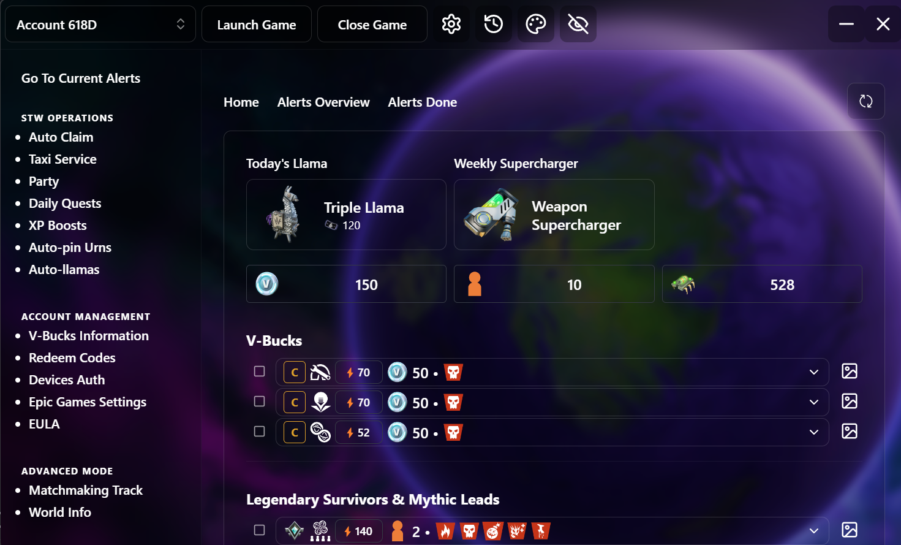
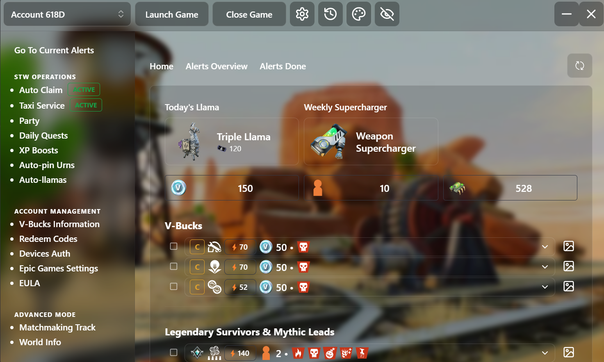
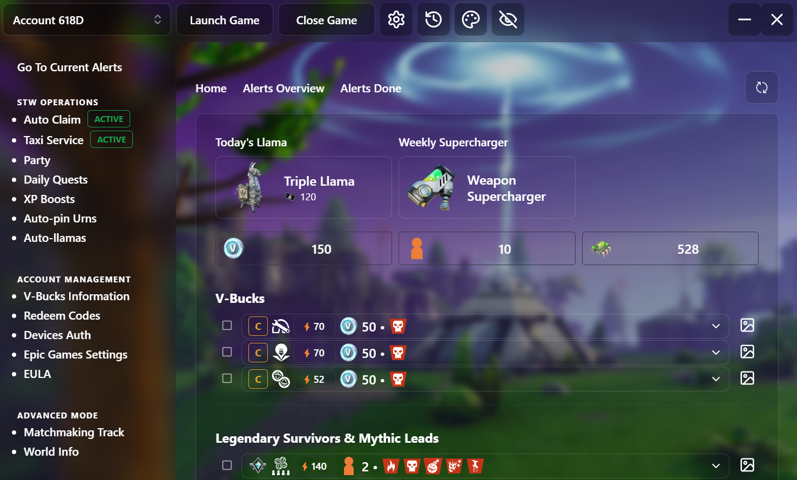
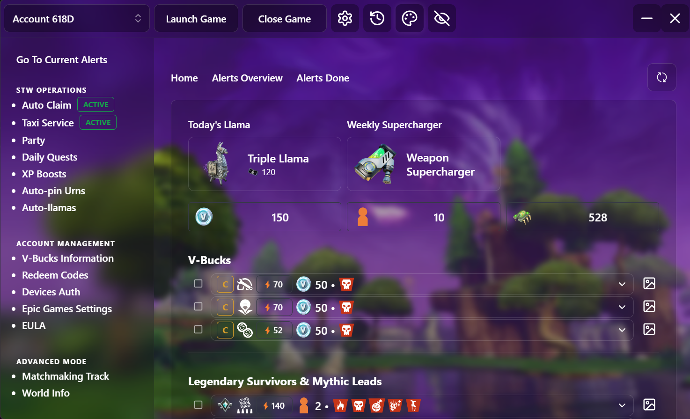

# Mystic's Aerial Launcher

**A Windows launcher for Fortnite Save the World**

Manage all your accounts, track mission alerts and automate the daily grind, all from one place.

## Why Mystic Launcher

Aerial Launcher has not been updated since its last release (v1.12.3, March 2026), and Fortnite has changed a lot since then. Parts of it stopped working, like the Taxi Service with the new party system.

So I made Mystic Launcher as an enhanced version: kept up to date with Fortnite, with the broken features fixed and new ones added.

## Features

### Home
- **Today's Llama** from the X-Ray Llama shop, with its price
- **Weekly Supercharger** reward for the Twine Peaks weekly quest
- **Mission alerts** for V-Bucks, Legendary Survivors and Mythic Leads, with totals across all zones
- **Alerts Overview** and **Alerts Done** to track what each account has finished

### STW Operations
- **Taxi Service** with normal and reverse taxi. The taxi leaves as soon as a server is found, so you load in alone.
- **Auto Claim**, **Daily Quests**, **XP Boosts**, **Auto-pin Urns** and **Auto-llamas**
- **Party** tools for your accounts

### Account Management
- Multiple accounts with quick switching
- **V-Bucks Information**, **Redeem Codes**, **Devices Auth**, **Epic Games Settings** and **EULA**

### Advanced Mode
- **Matchmaking Track** and **World Info**

### Look and privacy
- Themes and a clean frosted glass style
- **Hide account names** for streaming and recording

## Themes

Pick a background from the palette button at the top of the launcher.

<table>
  <tr>
    <td align="center"> <b>Canny Valley</b></td>
    <td align="center"> <b>Storm Shield</b></td>
    <td align="center"> <b>Stonewood Storm</b></td>
  </tr>
</table>

## Install

1. Download **Mystic Launcher Setup** from the [latest release](../../releases/latest).
2. Run the installer. Future updates install over it and keep your accounts and settings.
3. Coming from Mystic Launcher 2.x? Uninstall it first (your accounts and settings are kept), then run the installer.
4. If Windows shows "Windows protected your PC", click **More info** and then **Run anyway**. The installer is not code signed.

Your accounts and settings are stored on your PC in `%APPDATA%\mystic-launcher-data`.

## Want to help?

Help is welcome, whether that is fixing a bug, adding a feature or testing a new version.

1. **Fork the repo** to your own account.
2. **Make your changes** on a new branch in your fork.
3. **Open a Pull Request** back to this repo and describe what you changed and why.

Found a bug or have an idea? [Open an issue](../../issues) with as much detail as you can, screenshots help a lot.

### Building it yourself
1. Install [Node.js 22](https://nodejs.org) or newer.
2. Run `npm install` in the `launcher` folder (all the launcher's code is in there).
3. Run `npm start` to open the launcher in development mode.
4. Run `npx electron-forge make` to build the installer into `out\make`.

## Credits

Mystic Launcher is built on [Aerial Launcher](https://github.com/Ciensprog/Aerial-Launcher) by [Ciensprog](https://github.com/Ciensprog). Thank you for the original project.

Licensed under the [GNU General Public License v3.0](LICENSE).
